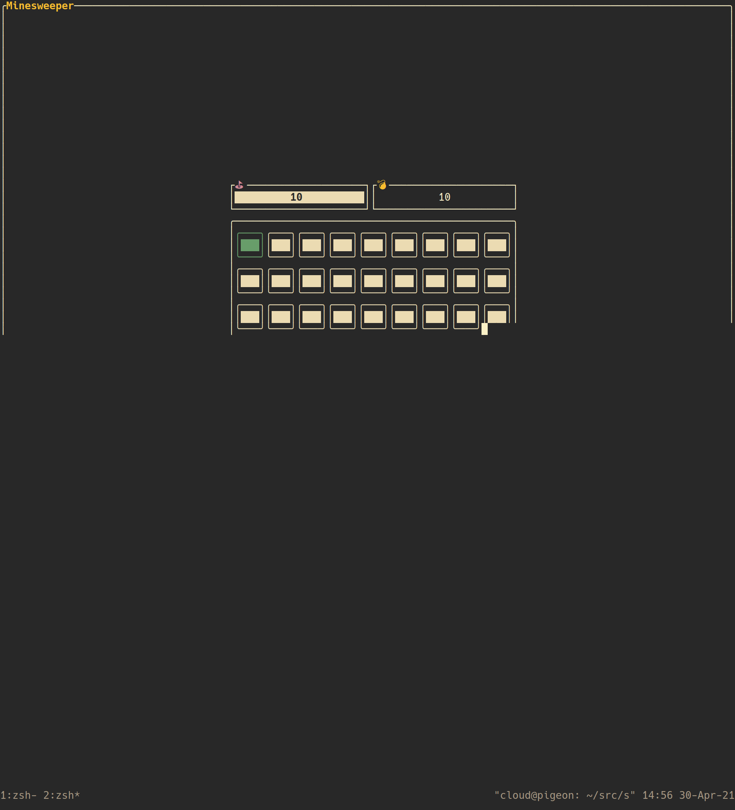

# `minesweep-rs`

[](https://github.com/cpcloud/minesweep-rs/actions/workflows/ci.yml)

A mine sweeping game written in Rust using `tui-rs`.

## Demo

Run with:

```
$ docker run --rm -it ghcr.io/cpcloud/minesweep-rs:latest
```


